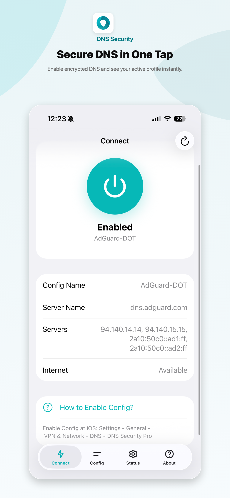
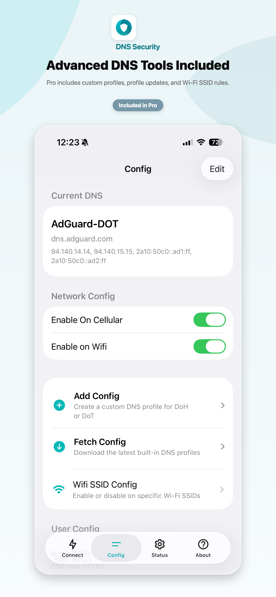
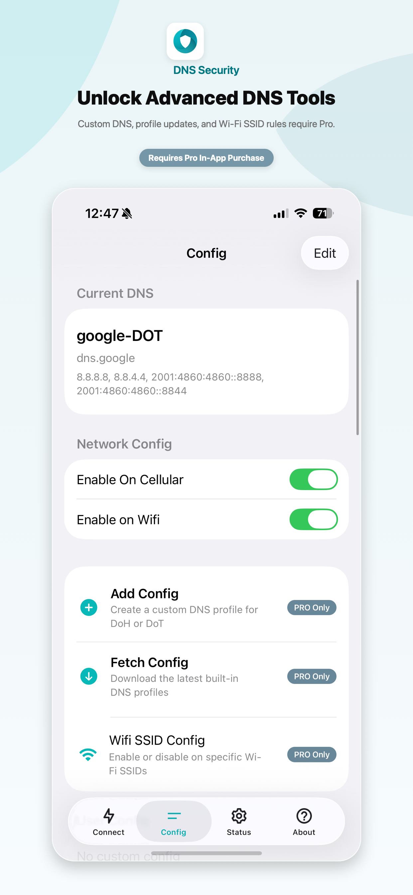
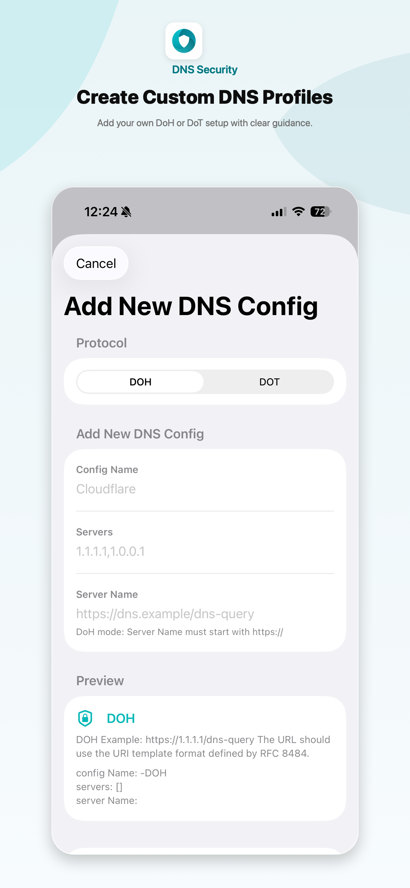
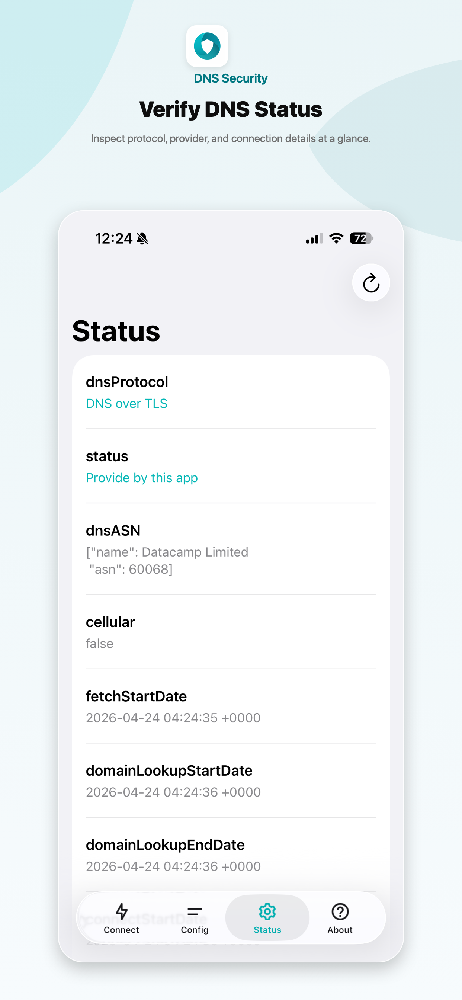
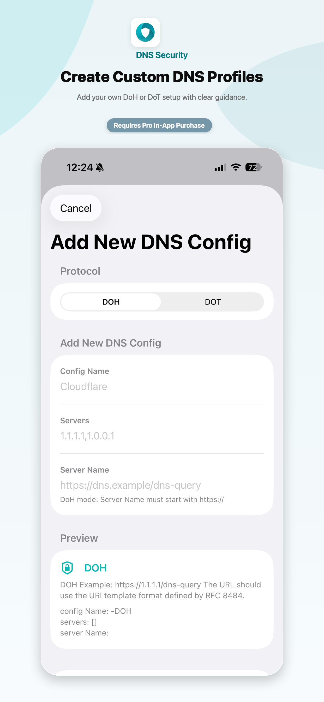

# DNS Security

Secure DNS for iOS and Mac with DNS over HTTPS and DNS over TLS. DNS Security protects DNS lookups without routing all traffic through a VPN server.

## App Store

- [DNS Security Lite](https://apps.apple.com/us/app/id1537782072)
- [DNS Security Pro](https://apps.apple.com/us/app/id1533938029)

## Current Features

- One-tap encrypted DNS setup from the Connect tab
- Built-in DNS profiles for trusted providers
- Custom DNS profiles for DoH and DoT
- Wi-Fi SSID enable/disable rules
- DNS status verification
- Shortcuts and URL scheme profile switching for Pro users
- In-app language selection with restart notice
- Lite with Pro unlock, plus a separate Pro app with Pro included

## Screenshots

## How to Enable

1. Open DNS Security and choose a DNS profile.
2. Enable the switch in the Connect tab.
3. Open iOS Settings.
4. Go to General - VPN & Network - DNS.
5. Select DNS Security.

On Mac, enable the DNS proxy in System Settings - Network - VPN & Filters - Filters & Proxies.

## Privacy

DNS Security only configures DNS resolution through the provider you choose. It does not route all traffic through an app server, and it does not collect your browsing data.

## More

- [What is DNS over HTTPS/TLS?](dohdot)
- [Privacy Policy](policy)
