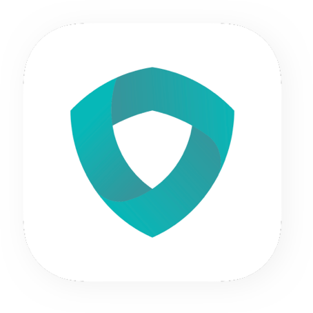

# DNS Security

#### First app use iOS 14 new feature DNS over HTTPS or DOT without install any VPN config!!
Secure your DNS query without touch your network connection.

### Do you know ? What's DNS over HTTPS/TLS ?

Even if you are visiting a site with HTTPS, your DNS query is sent over an unencrypted connection. That means that even if you are any website with HTTPS. Anyone listening to packets on the network still can know you are visiting some website. It is easy for a Man-In-The-Middle to change DNS answers to route unsuspecting visitors to their phishing, malware or surveillance site with unencrypted DNS. Your ISP, router, network provider may have an ability to track you. So. here comes DNS over HTTPS or DNS over TLS to secure the DNS query.

### Feature
This app use the iOS 14 new feature DNS over HTTPS and DNS over TLS. 
First app have DNS over HTTPS and DNS over TLS without any VPN config. Install any VPN may send your all network connection to server.

### Privacy
This app only secure your DNS query with trust famous service provider. It don't send your other connection to any server. We don't collect any information!! It don't collection any IP or Device ID....etc.

### Transparent
Choose trust service provider you want.
You can choose Google, Cloudflare, AdGuard......etc. DNS over HTTPS/TLS service provider.

1. DNS over HTTPS(DOH) use port 443, like your HTTPS connection.
2. DNS over TLS(DOT) use port 853.

You may need to follow steps to enable DNS settings.
1. After enable Switch in app.
2. Go to iPhone - Settings - General - VPN & Network - DNS - Select "DNS Security"

If you got connection problem with this app, please try to select other config profile or try to re-enable the app. Some service provider may unavailable in your area due to this problem.

If you have any suggestions, you can leave a review for us. We will continue to make this app greater.

