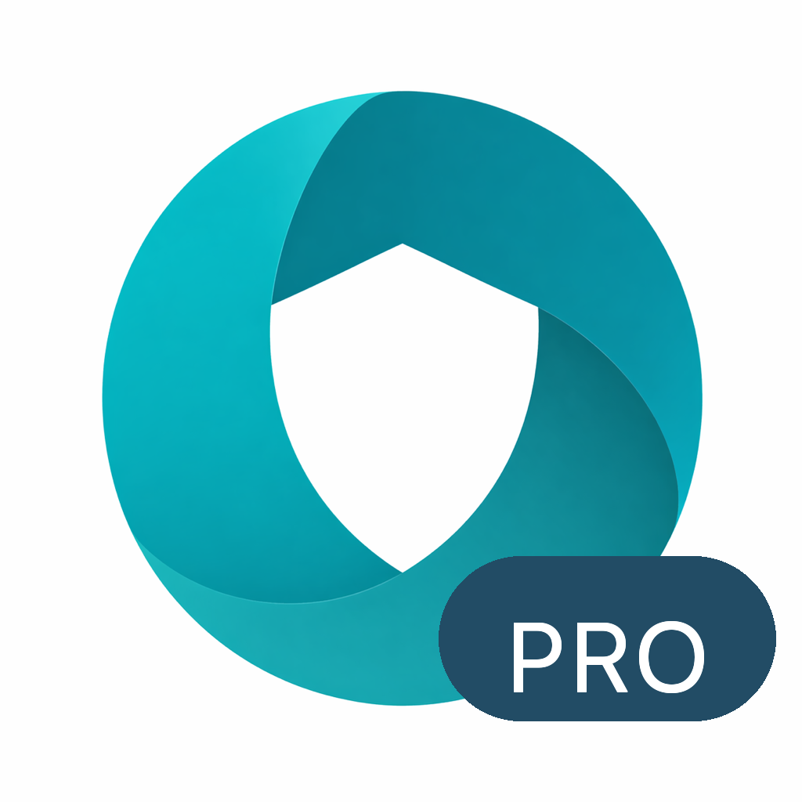

<section class="hero">
  

    
    
  

  <h1>DNS Security</h1>
  
Secure DNS for iOS and Mac with DNS over HTTPS and DNS over TLS. Keep DNS queries encrypted without routing all traffic through a VPN server.

  

    <a class="app-link" href="https://apps.apple.com/us/app/id1537782072">Download DNS Security Lite</a>
    <a class="app-link" href="https://apps.apple.com/us/app/id1533938029">Download DNS Security Pro</a>
  

</section>

## What DNS Security Does

DNS Security configures Apple's system DNS settings to use encrypted DNS resolvers. It protects DNS lookups while leaving the rest of your network traffic untouched.

## Features

  

    <h3>One-tap encrypted DNS</h3>
    
Enable DNS over HTTPS or DNS over TLS from the Connect tab and follow the system prompt to activate the DNS profile.

  

  

    <h3>Built-in DNS profiles</h3>
    
Use trusted DNS providers such as Google, Cloudflare, and AdGuard, with Lite and Pro behavior clearly separated.

  

  

    <h3>Custom DNS profiles</h3>
    
Create your own DoH or DoT profile with validation for DNS server addresses and server names.

  

  

    <h3>Wi-Fi SSID rules</h3>
    
Choose where DNS should be enabled or disabled by matching Wi-Fi SSIDs.

  

  

    <h3>DNS status check</h3>
    
Review the current DNS profile, protocol, proxy state, and network status from the Status screen.

  

  

    <h3>Shortcuts support</h3>
    
Pro users can switch DNS profiles from Shortcuts or other apps with the custom URL scheme.

  

## Screenshots

  <figure>
    
    <figcaption>Secure DNS in one tap</figcaption>
  </figure>
  <figure>
    
    <figcaption>Pro included</figcaption>
  </figure>
  <figure>
    
    <figcaption>Lite upgrade path</figcaption>
  </figure>
  <figure>
    
    <figcaption>Custom DNS profiles</figcaption>
  </figure>
  <figure>
    
    <figcaption>Verify DNS status</figcaption>
  </figure>
  <figure>
    
    <figcaption>Pro-only tools</figcaption>
  </figure>

## Lite and Pro

DNS Security Lite includes the core encrypted DNS workflow. Pro unlocks advanced controls such as custom DNS profiles, Wi-Fi SSID rules, and profile switching from Shortcuts or other apps.

DNS Security Pro is a separate paid app with Pro included from the start. DNS Security Lite can unlock Pro features with an in-app purchase.

## How to Enable

1. Open DNS Security and choose a DNS profile.
2. Enable the switch in the Connect tab.
3. Open iOS Settings.
4. Go to General - VPN & Network - DNS.
5. Select DNS Security.

On Mac, enable the DNS proxy in System Settings - Network - VPN & Filters - Filters & Proxies.

## Privacy

DNS Security only configures DNS resolution through the provider you choose. It does not route all traffic through an app server, and it does not collect your browsing data.

## Learn More

- [What is DNS over HTTPS/TLS?](dohdot)
- [Privacy Policy](policy)
